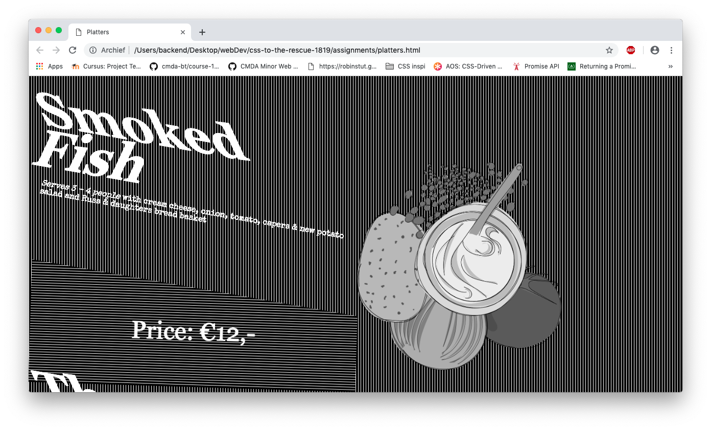
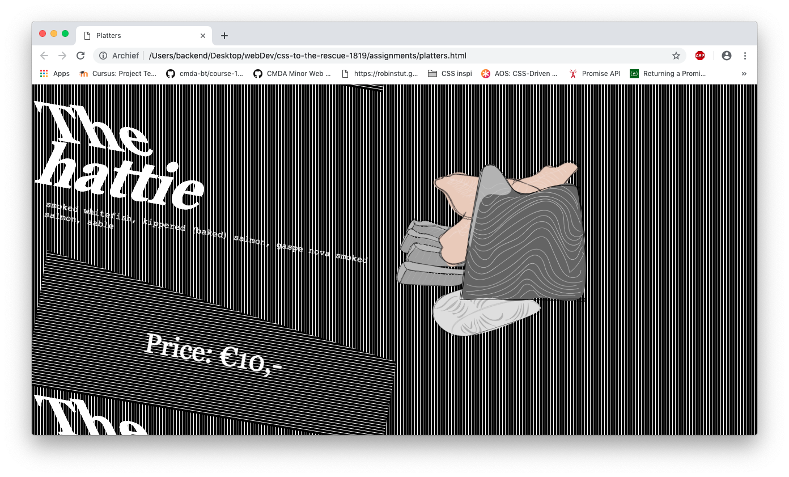

**CSS to the Rescue @cmda-minor-web 18-19**

# Interactive Menu Card

The interactive Menu card is a project of the minor Web Developement. The menu displays in a visual and abstract form what ingredients the dishes contains. By hovering over different elements, some elements will start/stop animating. 

## BEM

I have used the BEM methodology. BEM is a structured way to name your styling classes in that everyone could understand what classes are handling which styling elements.

## Restrictions

- [x] No shapes
- [x] Two colors
